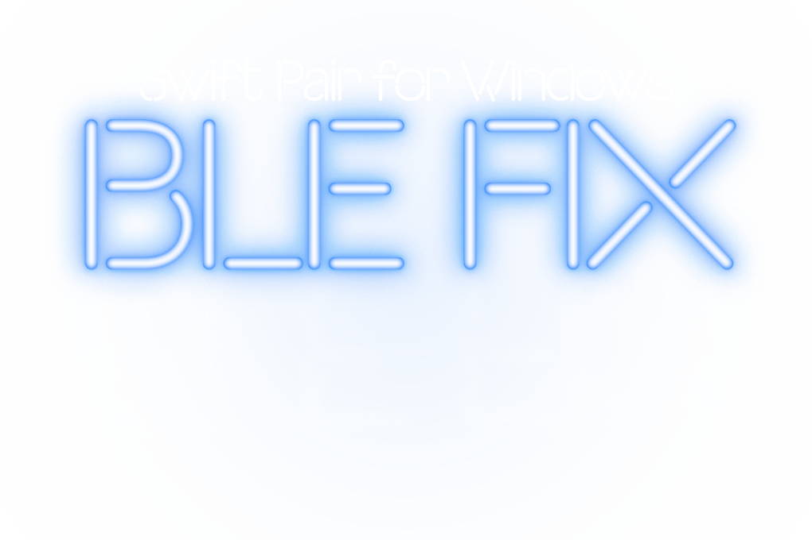

<br>


 # Bluetooth spam fixes for CYD Marauder


**Below is the necessary edits to make in WifiScan.cpp file for ble spam attacks to<br>
not crash out.**  


## Non edited code.

```
void WiFiScan::executeSwiftpairSpam(EBLEPayloadType type) {
  #ifdef HAS_BT
    uint8_t macAddr[6];
    generateRandomMac(macAddr);

    esp_base_mac_addr_set(macAddr);

    NimBLEDevice::init("");

    NimBLEServer *pServer = NimBLEDevice::createServer();

    pAdvertising = pServer->getAdvertising();
    delay(20);
    //NimBLEAdvertisementData advertisementData = getSwiftAdvertisementData();
    NimBLEAdvertisementData advertisementData = this->GetUniversalAdvertisementData(type);
    pAdvertising->setAdvertisementData(advertisementData);
    pAdvertising->start();
    delay(1000);
    pAdvertising->stop();

    NimBLEDevice::deinit();
  #endif
}
```
<br>
<br>

## Edited code

```
void WiFiScan::executeSwiftpairSpam(EBLEPayloadType type) {
  #ifdef HAS_BT
    uint8_t macAddr[6];
    generateRandomMac(macAddr);
    delay(5);
    esp_base_mac_addr_set(macAddr);
    delay(5);
    NimBLEDevice::init("");
    delay(5);
    NimBLEServer *pServer = NimBLEDevice::createServer();
    delay(5);
    pAdvertising = pServer->getAdvertising();
    delay(20);
    //NimBLEAdvertisementData advertisementData = getSwiftAdvertisementData();
    NimBLEAdvertisementData advertisementData = this->GetUniversalAdvertisementData(type);
    pAdvertising->setAdvertisementData(advertisementData);
    pAdvertising->start();
    delay(1000);
    pAdvertising->stop();
    delay(5);
    NimBLEDevice::deinit();
  #endif
}
```

<br>
<br>

<p align="left">  </p>
<p align="left"> <a href="https://twitter.com/a_t_o_m_nft" target="blank"></a> </p>
