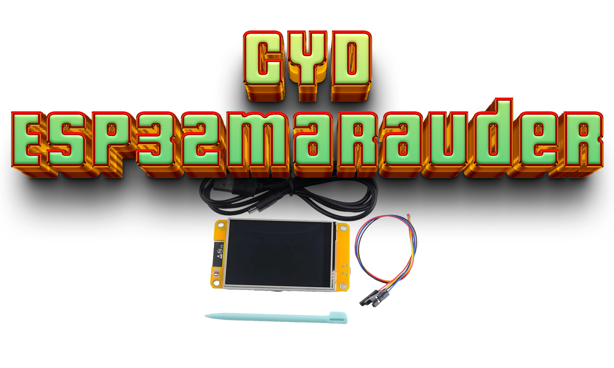

 

  <b>A beautiful fork of wifi Maraduer, a suite of WiFi/Bluetooth offensive and defensive tools for the 2.8'' ESP32 Module ESP32-2432S028R WiFi+BT Dual-core 240X320 Smart Display.</b>
  <b>This fork features a few great fixes and customzations.</b>
  
   
  
  ## To install this fork of marauder
  <b>Head over to <a href=https://github.com/smoochiee/MARAUDER-FOR-CYD---CHEAP-YELLOW-DISPLAY>smoochiee's tutorial.</a></b>
  <b>Follow the steps provided by the legend himself and you should be good to go. I will be adding my own tutorial for flashing this build to your CYD very shortly.</b>
  
   
   
  
  <b>A huge thank you goes to two wonderful people. Whom without I would have not made it as far as I  did learning.</b>  
  <b>Thanks to <a href=https://github.com/Fr4nkFletcher>Fr4nkFletcher</a> for all your guidance and late night replies.</b>
  <b>And thank you to <a href=https://github.com/smoochiee>smoochiee</a> for helping with the bootscreen and the badass tuts for building our own Marauder.</b> 
  
  
   
   
  
  
  ## Adjusted sd card portal storage
  I have tweaked a section of two files (EvilPortal.cpp & SDInterface) to allow the portals used in EP to be stored in a folder on the sd card instead of just being stored in the root folder. </b>
  
    
  <b>The folder must be titled "portals" and I will include a zip with the folder and the ap.config file to upload directly to a sd card to use in the CYD</b>
   
  
  <a href="https://github.com/ATOMNFT/CYD-ESP32Marauder/tree/master/Evil%20Portal%20Stuff" target="_blank">[Evil Portal sd card Folder]</a>
